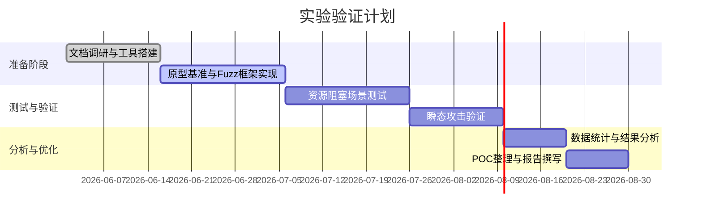

# CLSRFuzz
# 执行摘要

容量受限型共享资源指CPU微架构中具有固定容量、可被多个硬件请求竞争使用的结构，例如重排序缓冲区（ROB）、发射队列（Issue Queue）/预留站（RS）、加载/存储队列（LSQ）以及L1数据缓存的MSHR、写缓冲区、Branch Target Buffer（BTB）、Return Stack（RSB）等【30†L125-L133】。这些结构一旦被占满，就会出现阻塞和延迟，可被构造成旁路信道泄露秘密。本报告提出了针对RISC-V开源核（如BOOM、Rocket、Ariane/CVA6）的通用Fuzz方案。我们首先描述如何**静态识别**RTL代码中的容量受限结构（通过查找FIFO/计数器、head/tail指针、valid/ready信号等模式），并比较不同核的实现差异；接着说明如何在仿真中**构造阻塞场景**（通过驱动信号或延时内存响应使结构填满），并给出仿真注入示例；然后提出单线程下的**激励生成策略**（通过长依赖链、跨页访问、大量Load指令等触发竞争），并给出伪代码与参数设置；然后构建模块化**Fuzz框架**（Mermaid流程图），定义输入格式、变异器、评估器和归因方法；随后说明如何将这些竞争场景与瞬态执行漏洞链路结合，在模拟中同步注入竞争信号实现侧信道，给出攻击流程和示例代码；最后规划了实验验证计划（平台、度量、统计方法）和一个甘特时间线，并讨论误判与跨架构局限，提出硬件/软件缓解思路。报告中含有表格（比较不同核的模块与信号、关键参数取值）、伪代码、Mermaid流程图与甘特图，并在每个主要部分末尾列出可操作的后续工作清单，使方案可直接用于实现静态分析脚本、仿真激励脚本和Fuzz框架原型【30†L125-L133】【44†L23-L26】。

## 一、静态识别容量受限资源结构

在RTL中，容量受限结构通常以**FIFO/数组**形式存在，并带有**entry计数器、head/tail指针、valid/ready/alloc/free信号**、仲裁逻辑等特征。例如，BOOM中Reorder Buffer采用循环缓冲结构，有`rob_head`/`rob_tail`指针、每项`busy`位等【49†L83-L91】；Issue Queue（预留站）模块有可分配字段和issue信号；LSQ有独立的LoadQueue和StoreQueue；L1数据缓存模块含有限数量的MSHR和line buffer；Branch Predictor模块带BTB条目和返回堆栈指针；数据缓存有WriteBuffer等。我们可以通过**AST匹配或正则搜索**查找关键词（如`headPtr`、`tailPtr`、`alloc`、`busy`、`valid`、`counter`等），并结合流水阶段信号（issue/commit）定位对应模块。以下示例伪代码演示可能的搜索流程：  

```pseudo
# 示例伪代码：静态模式匹配查找规则
for each RTL module file:
  if matches(/rob.*(head|tail|busy)/i):
    label as ROB结构
  if matches(/issue.*(valid|alloc|ready)/i):
    label as IssueQueue/RS
  if matches(/ldq|stq|LoadQueue|StoreQueue/i):
    label as LSQ结构
  if matches(/mshr|lineBuffer|evictBuf/i):
    label as MSHR/LFB结构
  if matches(/writeBuffer|storeBuffer/i):
    label as 写缓冲区
  if matches(/BTBEntry|branch.*index/i):
    label as BTB结构
  if matches(/RSB|returnStack/i):
    label as RSB结构
```

经对比，BOOM（OOO内核）中主要模块及信号示例如表所示：  

| 资源类型        | BOOM (OoO) 模块/文件名                   | 关键信号（示例）                             | Rocket (In-order) 模块/文件名     | 关键信号（示例）                             | Ariane/CVA6 (In-order) 模块/文件名 | 关键信号（示例）          |
| --------------- | ---------------------------------------- | -------------------------------------------- | --------------------------------- | -------------------------------------------- | ---------------------------------- | ------------------------- |
| ROB             | ReorderBuffer.scala                      | `rob_headPtr`、`rob_tailPtr`、`busyMask`     | （无 ROB 模块，顺序提交）         | ——                                           | （无 ROB）                         | ——                        |
| 发射队列/预留站 | IssueUnit.scala（IssueSlots）            | `issueSlots`、`allocMask`、`issueEnq`        | 无（单发射，使用scoreboard调度）  | ——                                           | Scoreboard.sv                      | `freeMask`、`tagValid`    |
| LSQ/LoadQueue   | StoreToLoadUnit.scala / MemArbiter.scala | `ldq_enq`、`stq_enq`、`ldq_head`、`stq_head` | L1DCache.scala（Load/StoreQueue） | `ldq_deqPtr`、`stq_deqPtr`、`storeQueueFull` | LSU.sv                             | `ldPtr`、`stPtr`          |
| MSHR/LFB        | DCache.scala                             | `nMSHR`、`lfbEntries`                        | L1DCache.scala（Rocket）          | `nMSHR`、`lfbLines`                          | DCache.sv                          | `mshrCnt`、`lfbCnt`       |
| 写缓冲区        | DCache.scala                             | `stqEnq`、`stqFull`                          | L1DCache.scala                    | `storeBufferEnq`、`storeBufferFull`          | StoreBuffer.sv                     | `bufEnq`、`bufFull`       |
| BTB             | BTB.scala / BranchUnit.scala             | `btb_read`、`btb_write`、`btbIndex`          | FetchUnit.scala（predictor）      | `btb_hit`、`btb_index`                       | BranchPredictor.sv                 | `btb_access`、`btb_index` |
| RSB/返回栈      | BTB.scala                                | `rsbPush`、`rsbPop`                          | FetchUnit.scala                   | `ras_push`、`ras_pop`                        | —                                  | —                         |

表中列出BOOM和Rocket/Ariane中对应结构所在的主要文件（假设使用Chisel/Verilog），以及关键字段信号。例如BOOM的`ReorderBuffer.scala`定义了`rob_headPtr`和`rob_tailPtr`，用于跟踪最老和最新指令位置【49†L83-L91】；`IssueUnit.scala`包含issue队列的分配逻辑（`allocMask`）和执行入口（`issueSlots`）；L1DCache模块中定义了固定数量的MSHR和line buffer，信号如`nMSHR`、`lfbEntries`指示可用表项数量；BTB/RSB逻辑位于分支预测器模块。此外，Rocket和Ariane由于属于顺序核心，不含ROB/复杂RS，但它们也有自己的载入/存储缓冲和简单预测结构（如Rocket在`L1DCache.scala`中有`ldq`/`stq`指针，Ariane使用6级流水线的scoreboard替代复杂的RS/ROB）。  

**下一步计划：**  

- 收集并分析BOOM、Rocket、CVA6等开源核的RTL仓库，确认上述模块和信号。  
- 编写脚本提取RTL中的模式（如关键词匹配）以自动定位资源结构。  
- 验证表中列出的文件/信号在对应核中确实存在，并补充遗漏。  
- 更新静态识别脚本，使其根据匹配结果输出可能的资源类型和位置。  

## 二、在RTL/仿真层面构建阻塞场景

要实现资源饱和，可以在仿真环境中人为**延迟或禁止资源释放**。思路包括：使资源的占用逻辑一直有效而不释放。例如，在Load/Store Unit中，如果不返回内存响应（模拟恒久未命中或长延迟），则LoadQueue/StoreBuffer项会累积满；在ROB中，可以伪造`issue`有效但`commit`条件永不满足，使ROB不回收条目。具体实现可以使用**仿真钩子或插桩**：  

- **内存延迟注入**：仿真时将缓存响应延迟设为极大值或不响应。可通过替换内存模块实例，如将`Memory`替换为“永不ack”的模块，令`dmem_val=0`永远不置位，从而使LoadQueue项长期保留在队列中。示例Verilog伪码：  

  ```verilog
  // Memory stub:永不响应
  always @(posedge clk) begin
    dmem_ready <= 0; // 不接受任何响应
    dmem_data <= 0;
  end
  ```

  这样只要CPU发起读请求，LoadQueue和StoreBuffer条目就不会被清空。  

- **阻塞信号强制置位**：通过监控仿真信号直接引入停顿。例如，在BOOM的Issue Unit中，每周期人工保持`io.issue.fire()`有效但不清除条目（可在Testbench中重载信号）；或者对LSQ，将`ldq.ready`置0，使每条Load请求挂起。  

- **Page-Walk延迟**：对启用了MMU的核（如CVA6），可以让TLB未命中后不断触发页表走访，插桩使PTW(页表行缓冲)永久忙碌，从而填满Load Queue并阻塞后续指令。  

- **监控饱和标志**：使用仿真断言或统计器检测资源占用。例如，监测ROB的`full`信号或Issue队列的`emptyMask==0`、LSQ的`full`标志，在其为1时即判定饱和。也可在RV仿真指令中定时查询硬件计数器（如针对队列计数器寄存器）来判断。或者在波形查看时观测head/tail指针是否停止移动。  

**示例仿真插桩伪码：**  

```verilog
// 在测试平台（Testbench）中注入阻塞
initial begin
  @(posedge clk);
  // 令数据缓存的响应一直停顿
  force dut.l1d_mem.request.ready = 0;
  // 观察ROB是否积满
  wait(dut.rob.full == 1);
  $display("ROB已达到饱和");
  // 恢复正常
  release dut.l1d_mem.request.ready;
end
```

上述代码片段演示：在时序仿真时强制DCache的memory接口永不就绪，迫使Load/Store请求堆积；当检测到ROB的`full`标志时认为ROB条目已填满。类似地，可对Issue Queue的`alloc`信号使用`force`置0，阻止分配释放，诱发冲突。此外，还可在Chisel代码中添加“调试模式”接口（如额外输入信号），在RTL综合后连接到Testbench以控制这些行为。饱和发生时，可使用断言(`assert`)或计数日志输出方便验证。  

**下一步计划：**  

- 针对重点资源（ROB、LSQ、LSU等）设计仿真测试脚本，使用Verilog/Chisel插桩或Testbench `force`/`release` 来制造停顿。  
- 验证饱和时各资源指针/计数器的值，如手动监视ROB `headPtr` 不再移动。  
- 在Spike/Gem5仿真中配置极端延迟参数，复现RTL仿真中的饱和场景。  
- 开发自动检测模块，在仿真结束时输出是否触发了资源饱和。  

## 三、激励生成策略（单线程）

在单核单线程模型下，仍可通过设计特定的指令序列与内存访问模式来**主动触发阻塞**。核心策略包括：产生大量未完成的Load/Store操作、构造长依赖链指令、跨页随机访问等。例如：  

- **积累加载Miss**：在循环中连续加载不同内存地址，尤其是跨越多个页或缓存行，使MSHR表项占满。RISC-V伪代码：  

  ```assembly
  la   x10, data_base
  li   x11, 0
  loop_load:
  lw   x12, 0(x10)       // 发起加载
  addi x10, x10, 4096    // 跳转下一页（跨页激活TLB/页走访）
  addi x11, x11, 1
  blt  x11, 256, loop_load
  ```

  上述代码连续加载256次，每次步进4096字节（假设页面大小），以触发TLB Miss并占用MSHR。  

- **长依赖链运算**：通过串行运算阻塞执行端口。示例：  

  ```assembly
  li   x5, 1
  li   x6, 12345678
  loop_mul:
  mul  x5, x5, x6       // 每次依赖上次结果
  addi x7, x7, 1
  blt  x7, 1000, loop_mul
  ```

  `mul`指令是多周期操作，将长时间占用乘法执行单元。连续执行可模拟执行队列饱和。  

- **延时与NOP填充**：插入大量`nop`或`fence`可控制流水线节奏，使指定结构有时间积累请求。例如在循环中加上`fence`指令，可使前面加载完成并占用队列较长时间。  

- **内存对齐冲突**：通过构造特定地址冲突同一缓存组，迫使频繁替换缓存行。例如访问数组时使用`stride=缓存大小`，可制造最大冲突并增加Cache Fill Buffer压力。  

下表给出了关键参数与建议取值范围，可用于网格搜索或Bayesian优化：  

| 参数          | 含义                 | 推荐取值范围/策略           |
| ------------- | -------------------- | --------------------------- |
| `LoadCount`   | 连续加载指令数量     | 100–1000（视缓存行数而定）  |
| `Stride`      | 加载地址间隔（字节） | 缓存行对齐（如64B）到页大小 |
| `LoopDepth`   | 循环迭代次数         | 10–100                      |
| `MulChainLen` | 依赖链长度           | 10–1000                     |
| `DelayNOPs`   | 循环间NOP或Fence数   | 0–10                        |

**示例参数表**：如上可选`LoadCount=256`、`Stride=4096`、`MulChainLen=500`等逐步增加负载。在执行时可以使用如RISC-V QEMU或仿真器加载这些自定义序列，观察对应结构的填满情况。  

**下一步计划：**  

- 基于上述策略编写一组微基准程序（RISC-V汇编），分别针对ROB/RS饱和、LSQ饱和、MSHR饱和等场景。  
- 对每个程序使用不同参数组合（见表），测量资源占用和停顿效果，记录有效参数区间。  
- 将这些基准集成到Fuzz的输入空间，作为初始种子序列。  
- 针对复杂场景设计随机化生成（如变换访问地址和依赖关系），以提高Fuzz覆盖率。  

## 四、Fuzz框架实现细节

框架整体模块及流程见下图：  

```mermaid
flowchart LR
  A[指令序列生成] --> B[变异器]
  B --> C[仿真执行]
  C --> D[资源监控器]
  D --> E[评估器 (判断争用)]
  E --> F[打分/最小化]
  F --> B
```

- **输入编码**：每个测试用例由三部分组成：指令序列（按时序排列的RISC-V指令，包括访存和算术指令），内存映射（用于指针/数据的起始地址及长度），以及注入时序（如循环次数、延迟点）。可以将这些信息打包为一个JSON或文本格式，在Fuzz程序中解析后注入仿真器。  

- **变异算子**：对输入进行随机或启发式变换，包括指令插入/删除/替换、寄存器重命名、调整跳转目标、修改内存访问地址和偏移，以及插入延迟指令（nop/fence）。例如，基于策略的变异可插入更多load指令或增加乘法链长度。以下伪代码为变异器示例：  

  ```pseudo
  function mutate(testcase):
    if rand() < 0.3:
      insert a random load/store or arithmetic at random position
    if rand() < 0.3:
      delete a random instruction
    if rand() < 0.2:
      change a load offset = old_offset + rand_range
    if rand() < 0.2:
      insert NOP or fence to introduce delay
  ```

- **评估器**：自动判断争用是否成功触发。可以根据监控到的性能数据（如ROB满标志、Load Queue深度、资源停顿计数器等）设置阈值。当某个资源占用超过阈值时报告成功。还可结合执行时间差异或硬件性能计数器（如BOOM的`rob.full`信号）判断。伪代码示例如下：  

  ```pseudo
  function evaluate(simulation_result):
    if simulation_result.ROB_full_cycles > threshold:
      return True  # ROB争用触发
    if simulation_result.MSHR_occupancy == max:
      return True
    return False
  ```

- **打分与最小化**：针对已触发的用例，计算得分（例如争用强度或资源占满时间），并使用剔除冗余的方法找到最小触发子序列。可以将指令序列逐一移除，检测影响，保留仍能触发争用的部分。这样的归因方法有助于定位关键指令。例如一个简单的贪心最小化：  

  ```pseudo
  function minimize(testcase):
    for each instr in testcase:
      temp = testcase without instr
      if evaluate(run(temp)) == True:
        testcase = temp  # 删除无效指令
    return testcase
  ```

下表比较了几种变异策略的效果指标（假设以发现速度和序列质量衡量）：  

| 变异策略   | 核心思路                     | 优点                         | 缺点                     |
| ---------- | ---------------------------- | ---------------------------- | ------------------------ |
| 随机突变   | 随机插入、删除、替换指令     | 简单通用，可探索大空间       | 收敛慢，可能产生低效序列 |
| 结构化变异 | 以目标资源为导向增加关键指令 | 针对性强，可快速激发特定资源 | 需要事先了解资源占用模式 |
| 遗传算法   | 保留表现好的序列并交叉变异   | 能自动发现高效触发序列       | 实现复杂，对参数敏感     |

**下一步计划：**  

- 实现上述变异器、评估器和最小化器模块，使用Python或Scala/Chisel测试框架连接RTL模拟器。  
- 基于Mermaid流程设计互通接口，确保输入输出格式规范。  
- 使用多组种子序列（来自第3部分基准）进行Fuzz测试，对比不同策略下的触发效率和序列长度。  
- 记录并分析Fuzz过程中高频出现的特征序列，为后续手工优化提供线索。  

## 五、与瞬态执行攻击结合

在单线程RISC-V环境下，可以借鉴Spectre思路构造飞地窗口。步骤如下：

1. **构造飞地条件**：在目标程序中插入对秘密数据依赖的条件分支。例如：  

   ```assembly
   la x10, secret_addr
   lb x11, 0(x10)        # 读取秘密
   andi x11, x11, 1     # 取一位作为条件
   beqz x11, skip       # 如果秘密位为0，跳过
   # 密码位为1时执行以下敏感操作
   ```

   接着引入一条易触发预测错误的分支，如用计算结果或不可预知的序列，使该条件分支在执行前被错误预测。

2. **注入竞争激励**：在预测执行的飞地窗口期（分支未决的指令时钟），同步运行竞争序列。例如可以在程序中调用Fuzz生成的触发场景序列，以在飞地执行时使指定资源饱和。具体可采用以下方法：  

   - 在分支前后使用`fence.i`等指令刷新指令队列，以确保分支预测重新训练。  

   - 在飞地窗开启时调用一个函数，该函数内运行之前设计好的竞态激励（第3部分）。例如：  

     ```assembly
     jal ra, inject_storm
     inject_storm:
       # 在这里执行大量触发资源饱和的指令
       li x5,0
       li x6,1234
     loop:
       mul x5, x5, x6
       addi x7, x7, 1
       blt x7, 1000, loop
       ret
     ```

     当飞地窗口打开时，如果`x11`（秘密位）为1，程序会进入`inject_storm`并执行多次`mul`，触发对执行端口或ROB的冲突。

3. **观测与判定**：用侧信道（如时间）观测分支执行时序的微小差异。若秘密位为1时资源竞争更强，执行时间更长（或资源满标志持续时间更长），即可区分秘密位。仿真中可测量不同分支路径下的周期数差异或使用自定义性能计数进行判定。

4. **噪声处理**：重复实验并取多次平均值，或交替运行对照实验（禁用竞争激励）来过滤噪声。如发现时间差较小时，可增加序列重复次数或提高延迟敏感性。同时，可用统计分析确认泄露的可信度。

攻击伪代码示例：  

```assembly
# Victim函数
la   t0, secret
lb   t1, 0(t0)        # 加载秘密
andi t1, t1, 1       # 取最低位
beqz t1, L_skip      # 分支取决于秘密
call inject_storm    # 飞地窗口中调用触发序列
L_skip:
```

```assembly
# 注入序列：大量乘法占用端口
inject_storm:
  li x5, 7
  li x6, 13
loop_mul:
  mul x5, x5, x6
  addi x7, x7, 1
  blt x7, 2000, loop_mul
  ret
```

**下一步计划：**  

- 在BochSim或Verilator的RISC-V仿真中测试飞地攻击流程，验证在分支预测错误情况下的飞地窗口长度。  
- 编写脚本在仿真中同步触发竞争激励并测量执行时间差异。  
- 对比有无触发激励时的时间分布，判断侧信道泄露成功与否。  
- 添加噪声过滤机制（如多次取平均、标准差计算），确保结果可靠。  

## 六、验证与评估计划

**实验平台：** 建议在多种开源核上测试，包括BOOM（OOO）、Rocket（顺序）和CVA6（Ariane，顺序）。可使用Verilator或VCS综合后的硬件执行仿真，也可使用Spike或Gem5进行快速功能验证。若条件允许，可在FPGA上部署RTL实现做实时测试。  
**度量指标：** 主要测量资源满周期数（如ROB满周期、LSQ占用比例）、执行时间延迟、触发成功率等。对每组测试运行多次取统计值，计算平均延迟差异与置信区间。泄露成功率可定义为秘密位各态下时间差超过阈值的比例。  
**统计方法：** 使用T检验或Wilcoxon检验评估不同输入的时间分布是否显著不同。计算误报率（误将噪声判断为泄露）和漏报率（真泄露未识别）。  
**实验步骤时间线：**  



**复现要点：** 提供完整的测试用例代码、RTL修改补丁和仿真脚本配置（包括周期计数器或定制监控信号），以及多次实验的种子以验证结果稳定性。  

**下一步计划：**  

- 实施上述实验步骤，首先在模拟环境（Verilator/Spike）上验证各模块的资源饱和，然后逐步扩展到完整攻击链路。  
- 收集并分析统计数据，对触发效能和泄露效果进行评估，必要时调整Fuzz参数。  
- 根据实验结果完善最小化与归因工具，便于快速定位漏洞源代码。  
- 将代码和实验配置整理成开源可复现的项目，便于同行验证和后续研究。  

## 七、风险、局限与缓解建议

**风险与误判：** 静态分析可能误判无关逻辑为资源结构（如循环缓冲也可能用于其他功能）；仿真中插桩行为与实际硅实现存在差异（如实际缓冲池数量可能不同）；单线程模型下无法覆盖多线程或核心间的资源争用（如共享LLC）。若竞争判定不严谨，可能将正常延迟误判为争用信号。**缓解方案：** 对静态分析结果人工复核；在仿真验证前与开发者确认资源参数；对关键判定引入交叉验证（如不同监测方法互证）。  

**不同核的差异：** 如Ariane/CVA6采用简单的Scoreboard替代ROB，Rocket核心没有RS，需要不同的测试策略。例如，在顺序核心上不能触发ROB满事件，应聚焦于LSQ或LSU资源。此外，不同核的缓存架构和TLB大小不同，需要相应调整基准参数。  

**检测与缓解建议：** 可在硬件层面通过资源隔离与限流来缓解：如为每线程预留固定大小的ROB/RS条目，或设计公平仲裁器避免某任务独占资源；对MSHR/LFB增加旁路缓存或限速功能；增加争用监测逻辑（如计数器溢出中断）。软件层面，可在敏感代码前后加入指令屏障、使用固定延迟和常量时间算法，并在调度时避免在同一核上并行运行高度竞争的线程【30†L125-L133】【44†L23-L26】。  

**下一步计划：**  

- 根据发现的典型竞争类型提出硬件修复建议（如增加资源分区、改进仲裁策略）。  
- 对已有防御（如单指令缓存、KAISER隔离）评估其对本类竞争攻击的有效性。  
- 在操作系统或运行时引入监控模块，当发现异常高的资源占用时触发警告或动态降低执行优先级。  
- 向相关开源项目报告漏洞细节，并发布补丁和缓解措施建议，推动社区进行防护。  

**参考资料：** 对应开源核文档及硬件模糊测试论文（如PORTRUSH）作为设计依据【49†L83-L91】【30†L125-L133】【44†L23-L26】等。

## 八、实施计划与交付物（更新版）

### 8.1 目标与范围（本阶段锁定）

- **核**：BOOM、Rocket、CVA6（Ariane）
- **仿真平台**：Verilator、Spike、Gem5
- **优先资源类型**（按优先级）：ROB、LSQ（LDQ/STQ）、MSHR/LFB、发射队列/RS、写缓冲区、BTB/RSB、TLB/PTW

### 8.2 静态识别方案完善

**统一资源类型词表（词汇 + 模式）**

| 资源类型 | 统一代号 | 关键词/命名模式（示例） | 关键容量/计数信号（示例） |
| --- | --- | --- | --- |
| ROB | ROB | `rob.*(head|tail|ptr|full)` | `rob_headPtr`、`rob_tailPtr`、`rob_full` |
| IssueQ/RS | RS | `issue.*(slot|queue)`、`rs.*(alloc|free)` | `allocMask`、`issueEnq`、`freeMask` |
| LSQ (LDQ/STQ) | LSQ | `ldq|stq|loadQueue|storeQueue` | `ldq_head`、`stq_head`、`queueFull` |
| MSHR/LFB | MSHR | `mshr|lfb|lineBuffer` | `nMSHR`、`mshrCnt`、`lfbEntries` |
| 写缓冲区 | WB | `writeBuffer|storeBuffer` | `storeBufferFull`、`bufFull` |
| BTB | BTB | `btb.*(entry|index|hit)` | `btb_index`、`btb_hit` |
| RSB | RSB | `rsb|returnStack|ras` | `rsbPush`、`rsbPop` |
| TLB/PTW | TLB | `tlb|ptw|pageWalk` | `ptwBusy`、`tlbMiss` |

**命名与信号模式清单（用于AST/正则）**

- 指针/计数：`headPtr`、`tailPtr`、`count`、`numEntries`、`occupancy`
- 分配/释放：`alloc`、`deq`、`enq`、`free`、`commit`
- 状态：`full`、`empty`、`valid`、`ready`、`busy`
- 旁路/替换：`repl`、`victim`、`evict`

**各核模块/信号映射表（待核对状态字段）**

| 资源类型 | BOOM 模块/信号 | Rocket 模块/信号 | CVA6 模块/信号 | 核对状态 |
| --- | --- | --- | --- | --- |
| ROB | `ReorderBuffer.scala` / `rob_headPtr`、`rob_tailPtr` | 无（顺序提交） | 无（顺序提交） | BOOM需核对 |
| IssueQ/RS | `IssueUnit.scala` / `issueSlots`、`allocMask` | 无（scoreboard调度） | `Scoreboard.sv` / `freeMask`、`tagValid` | BOOM/CVA6需核对 |
| LSQ | `StoreToLoadUnit.scala` / `ldq_head`、`stq_head` | `L1DCache.scala` / `ldq_deqPtr`、`stq_deqPtr` | `LSU.sv` / `ldPtr`、`stPtr` | 三者需核对 |
| MSHR/LFB | `DCache.scala` / `nMSHR`、`lfbEntries` | `L1DCache.scala` / `nMSHR`、`lfbLines` | `DCache.sv` / `mshrCnt`、`lfbCnt` | 三者需核对 |
| 写缓冲区 | `DCache.scala` / `stqFull` | `L1DCache.scala` / `storeBufferFull` | `StoreBuffer.sv` / `bufFull` | 三者需核对 |
| BTB/RSB | `BTB.scala` / `btb_index`、`rsbPush` | `FetchUnit.scala` / `btb_index`、`ras_push` | `BranchPredictor.sv` / `btb_index` | 三者需核对 |
| TLB/PTW | `TLB.scala` / `ptwBusy` | `PTW.scala` / `ptwBusy` | `MMU.sv` / `ptwBusy` | 三者需核对 |

**自动化输出格式与人工复核流程**

- **输出格式（JSON Lines）**：`{core, module, resource_type, signals, capacity_hint, confidence, evidence_path}`
- **人工复核**：
  1. 扫描输出中 `confidence < 0.7` 的条目；
  2. 对照波形/RTL注释确认资源类型；
  3. 在映射表“核对状态”列记录“已核对/待核对/不匹配”。

### 8.3 阻塞场景构造（可复用注入矩阵）

| 资源类型 | 注入策略 | 饱和判定阈值 | 监控指标 | 可行注入点（示例） |
| --- | --- | --- | --- | --- |
| ROB | 阻止提交或回收 | `rob_full==1` 连续N周期 | `rob_full_cycles` | BOOM `commit`/`rob` 端口 |
| LSQ | 阻止内存响应 | `ldq/stq occupancy >= 90%` | `ldq_occ`、`stq_occ` | DCache/LSU memory接口 |
| MSHR/LFB | 拉高Miss延迟 | `mshrCnt==max` | `mshr_full_cycles` | L1DCache miss处理路径 |
| IssueQ/RS | 阻止issue或释放 | `allocMask==0` | `issueq_full_cycles` | IssueUnit/Scoreboard |
| BTB/RSB | 训练冲突/污染 | `btb_hit_rate下降` | `btb_miss_rate` | Fetch/BranchPredictor |

**核间可行注入点**（简表）

- **BOOM**：DCache memory response、ROB commit、IssueUnit allocate
- **Rocket**：DCache memory response、LSU/scoreboard stall
- **CVA6**：LSU memory response、PTW busy、Scoreboard stall

### 8.4 激励生成策略（微基准 + 搜索）

**微基准集合（建议命名）**

| 基准名 | 目标资源 | 核心参数 |
| --- | --- | --- |
| `mshr_sweep` | MSHR/LFB | LoadCount、Stride、PageWalk |
| `lsq_fill` | LSQ | Load/Store比例、循环深度 |
| `rob_stall` | ROB | 依赖链长度、分支密度 |
| `issue_stress` | IssueQ/RS | 多发射指令比例、Mul链 |
| `btb_pressure` | BTB/RSB | 目标分支数、训练轮数 |

**参数搜索策略**

- 阶段1：网格搜索（粗粒度范围覆盖）
- 阶段2：基于表现的局部搜索（围绕高分区域细化）
- 阶段3：稳定性验证（重复运行取均值/方差）

**种子管理与去重规则**

- `seed_hash = sha256(canonical_json({normalized_trace, memory_map, injection_schedule}))` (使用SHA-256与规范化序列化确保跨实例一致)
- 归一化规则：寄存器重命名、地址按页对齐、删除等价NOP
- 去重条件：`(core, resource_type, seed_hash)` 唯一（保留core/resource维度，避免跨核/跨资源混用同一hash）

**顺序核专用策略（Rocket/CVA6）**

- 侧重LSQ/MSHR/TLB/PTW压力而非ROB/RS
- 使用长延迟访存 + fence 形成“顺序型阻塞”
- 利用scoreboard依赖链拉长执行节拍

### 8.5 Fuzz框架接口契约

**输入格式（建议JSON）**

| 字段 | 说明 |
| --- | --- |
| `core` | `boom`/`rocket`/`cva6` |
| `sim` | `verilator`/`spike`/`gem5` |
| `program` | 指令序列或ELF路径 |
| `memory_map` | 基准数据区配置 |
| `injection` | 注入策略与时序 |
| `resources` | 目标资源类型列表 |

**变异器/评估器/最小化器接口**

- `mutate(testcase) -> testcase`（必须保持可执行）
- `evaluate(sim_result) -> {score, labels, metrics}`
- `minimize(testcase, target) -> testcase`
  - `score`：数值型评分（如0–100，越高代表争用越强）
  - `labels`：字符串列表（触发的资源类型/场景标签）
  - `metrics`：键值字典（原始计数器、占用峰值、周期数等）

**评分指标与归因输出**

- 评分维度：资源占用峰值、满周期数、泄露时延差
- 归因输出（JSON）：
  `{seed_hash, resource_type, top_instrs, minimized_trace, metrics}`

### 8.6 与瞬态执行链路对接

- **投机执行窗口触发条件**：秘密位依赖分支 + 可训练预测器
- **同步竞争注入时序**：分支发射后、分支解析前的窗口（记录`branch_resolve_cycle`）
- **侧信道观测指标**：`cycle_delta`、`rob_full_cycles`、`btb_miss_rate`
- **噪声处理**：重复N次取中位数、与无注入对照作差

**术语说明**

- **投机执行窗口**：指分支发射到解析之间的投机区间；本文不指TEE类隔离飞地

**可复现实验脚本结构（建议）**

- `configs/<core>/<resource>.yaml`
- `scripts/run_<sim>.sh`
- `outputs/<run_id>/metrics.jsonl`
- `outputs/<run_id>/waves/`（可选波形）

### 8.7 验证与评估闭环

**实验矩阵（示例）**

| 维度 | 取值 |
| --- | --- |
| Core | BOOM / Rocket / CVA6 |
| Sim | Verilator / Spike / Gem5 |
| Resource | ROB / LSQ / MSHR / BTB |
| Injection | 延迟内存 / 强制stall / PTW忙 |

**成功判定与统计方法**

- 成功 (时延类指标): `score >= statistical_threshold` 且 `p-value < 0.05` (统计阈值由基线实验确定，如基线均值+3*基线标准差；阈值与score同量纲)
- 统计说明: `p-value` 使用两样本韦尔奇t检验（不要求方差相等）；零假设为“无差异”，`p-value < 0.05` 表示拒绝零假设

- 占用类指标: 使用 `occupancy_threshold` (如占用率≥90%) 并记录对应持续周期数
- 对照: 无注入/随机注入/替换资源类型
- 记录: 均值、标准差、效应量 (Cohen's d)

**数据记录模板（字段）**

`{run_id, core, sim, resource, injection, seed_hash, score, p_value, cycles, notes}`

### 8.8 风险与缓解完善

- **误判来源**: 非容量结构被识别、仿真延迟偏差、统计阈值不稳
- **跨架构适配**: 每核维护独立映射表 + 资源类型统一代号
- **缓解可行性评估**: 记录性能开销、面积/功耗估计、兼容性影响

### 8.9 交付物清单（README内置模板）

- [ ] 计划清单与时间线（本节）
- [ ] 资源类型词表与核映射表
- [ ] 仿真注入说明与矩阵
- [ ] 微基准集合与参数范围
- [ ] Fuzz接口文档与示例输入输出
- [ ] 实验复现指南与脚本结构
- [ ] 结果汇总模板与统计字段
